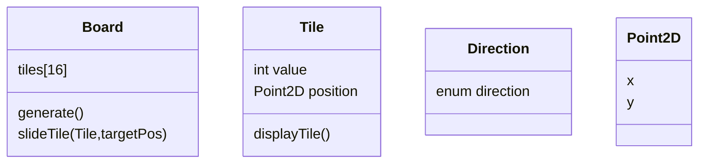

https://www.learncpp.com/cpp-tutorial/chapter-14-project/

A) What are the top-level things that your program needs to do? Here are a few to get you started:

Broad things to do

* Display game
* Generate random start configuration
* Move tiles
* Define win condition

User specifics

* Get user inputs
* Handle invalid inputs
* allow quit

B) What primary classes or namespaces will you use to implement the items outlined in Step 1? Also, what will your main() function do? 

namespace UserInput: This namespace has functions to get input from the user, to check whether the user input is valid, and to handle invalid input. Because this doesn’t have any state, we don’t need a class here.

main :
create board
start game
Game loop, while we dont quit and game is not won we wait for next input
